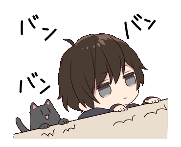

 *<h2 align=center> HEY! 😄 Welcome to my GitHub! &nbsp;  </h3>*

  <h4 align=center>I'm still a Junior Coder, so... there's a lot of zeroes in my stats... BUT, someday I'm gonna have a "S" GitHub acc!</h4>
  
<s>Working hard</s>

  

  
  

    
    
  

  

    
  

  
         
  
  ---

  ## ✨ Projects 

  #### I'm currently learning Elixir and, for practicing's sake, working on this: 
  	

  

  

  ## ğŸ‘👅👠Who am I? 

  Just a guy who likes to beat his brains out with puzzles and problems

  

    
    
  

  
              
  and........

  
<b>a guy who loves ✨🐾✨ animals ✨🐾✨</b>

  

    
  

  

  <!-- Vou manter esse comentário apenas porque sim :)
  **mahiro7/mahiro7** is a ✨ _special_ ✨ repository because its `README.md` (this file) appears on your GitHub profile.

  Here are some ideas to get you started:

  - 🔭 I’m currently working on ...
  - 🌱 I’m currently learning ...
  - 👯 I’m looking to collaborate on ...
  - 🤔 I’m looking for help with ...
  - 💬 Ask me about ...
  - 📫 How to reach me: ...
  - 😄 Pronouns: ...
  - ⚡ Fun fact: ...
  -->
